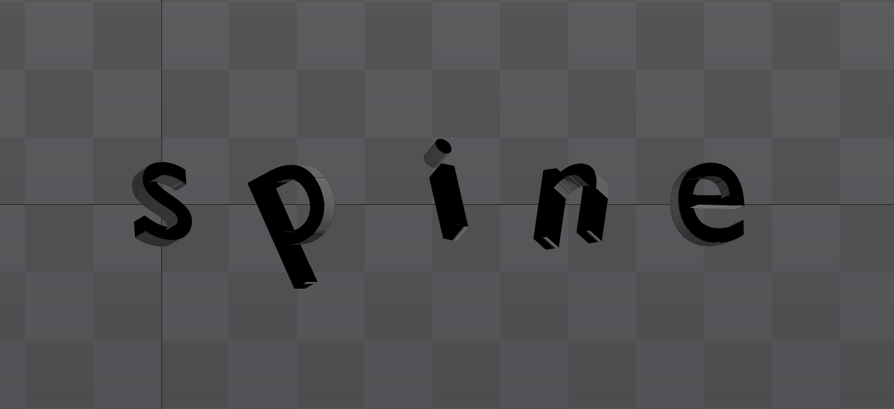
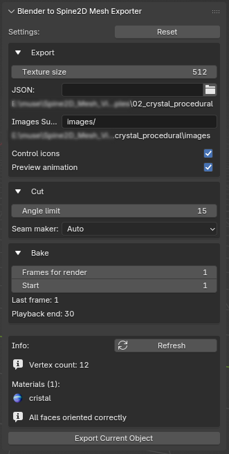

# Blender to Spine2D Mesh Exporter
<p align="center">
  
</p>

<p align="center">
  <!-- License Badge - Static -->
  
  
  <!-- Release Version Badge - Dynamic -->
  
  
  <!-- Total Downloads Badge - Dynamic -->
  
  
  <!-- Blender Version Badge - Static -->
  
  
  <!-- Patreon Support Badge - Static -->
  <a href="https://patreon.com/MaximSokolenko">
    
  </a>
</p>

[](https://www.youtube.com/watch?v=f_1Zc2qCz44 "Watch the Blender to Spine2D Mesh Exporter demonstration")

A comprehensive Blender addon that converts 3D mesh objects into Spine2D-compatible JSON skeletal animation data. This tool bridges the gap between 3D modeling workflows and 2D skeletal animation pipelines, enabling artists to leverage Blender's powerful modeling capabilities for Spine2D projects.

## Key Features

- **Intelligent Mesh Segmentation**: Automatically cuts complex meshes into animation-friendly segments using UV islands and angle detection
- **Advanced Texture Baking**: Bakes complex material setups into optimized textures for 2D workflows  
- **Multi-Object Export**: Process multiple objects simultaneously with automatic rig merging and constraint management
- **UV Layout Optimization**: Creates clean, efficient UV layouts with consistent texel density across segments
- **Spine2D Integration**: Generates production-ready JSON files compatible with Esoteric Software's Spine animation system

For detailed installation instructions, see [Installation Guide](docs/installation.md).

---

## Interface Overview

   

*The addon panel provides intuitive controls for export configuration, mesh segmentation settings, and texture baking parameters.*

All interface functionality and workflow details are documented in [Usage Guide](docs/usage.md).

---

## Project Structure

### Core Directories

```
Blender_to_Spine2D_Mesh_Exporter/
├── Blender_to_Spine2D_Mesh_Exporter/    # Main addon source code
│   ├── __init__.py          # Addon registration and lifecycle management
│   ├── main.py             # Core export pipeline orchestration
│   ├── ui.py               # User interface panels and operators
│   ├── config.py           # Configuration management and properties
│   ├── plane_cut.py        # Mesh segmentation and cutting algorithms
│   ├── uv_operations.py    # UV unwrapping and layout optimization
│   ├── texture_baker.py    # Material baking system
│   ├── json_export.py      # Spine2D JSON format generation
│   ├── json_merger.py      # Multi-object data merging
│   └── multi_object_export.py  # Batch processing workflows
├── tests/                   # Comprehensive test suite
│   ├── test_main.py        # Core pipeline testing
│   ├── test_json_export.py # JSON generation validation
│   └── test_ui.py          # Interface functionality tests
├── docs/                   # User and developer documentation
│   ├── installation.md    # Setup and installation guide
│   ├── usage.md           # Detailed usage instructions
│   └── architecture.md    # Technical architecture overview
├── tools/                  # Development and build utilities
│   └── prepare_package.py # Addon packaging and distribution
├── examples/              # Sample projects and demonstrations
├── assets/               # UI screenshots and promotional materials
└── .github/              # Issue templates and workflows
    ├── bug_report.md     # Bug reporting guidelines
    └── feature_request.md # Feature suggestion template
```
---
### Module Responsibilities
| Folders | Description |
| ------ | ------ |
|**Blender_to_Spine2D_Mesh_Exporter**| Contains all addon functionality with modular architecture |
|**tests**| Automated testing suite ensuring code reliability and performance |
|**docs**| Comprehensive documentation for users and contributors |
|**tools**| Development utilities for packaging and deployment |
|**examples**| Reference projects demonstrating addon capabilities |
|**assets**| Visual resources and interface documentation |

---

## Export Pipeline Workflow

The addon implements a sophisticated multi-stage pipeline that transforms 3D mesh data into Spine2D-compatible assets:

### Stage 1: Preprocessing and Validation
1. **Object Validation**: Verify mesh integrity and applied transformations
2. **Scale Application**: Ensure consistent object scaling across the pipeline
3. **Material Analysis**: Catalog and prepare materials for baking workflow

### Stage 2: Mesh Segmentation  
1. **Boundary Detection**: Identify natural mesh boundaries using angle thresholds
2. **UV Island Analysis**: Leverage existing UV layouts for intelligent segmentation
3. **Smart Cutting**: Execute hybrid cutting algorithm combining automated and manual approaches
4. **Seam Application**: Apply calculated boundaries as UV seams for unwrapping

### Stage 3: UV Layout Generation
1. **Unwrap Execution**: Generate clean UV layouts respecting segment boundaries  
2. **Texel Density Normalization**: Ensure consistent pixel density across all segments
3. **Island Optimization**: Optimize UV island placement for efficient texture usage
4. **Layout Validation**: Verify UV coordinates and detect potential issues

### Stage 4: Texture Baking
1. **Baking Setup**: Configure dedicated texturing objects with optimized UVs
2. **Material Processing**: Bake complex material setups to diffuse textures
3. **Quality Control**: Validate baked results and handle edge cases  
4. **UV Transfer**: Apply baked UVs back to segmented mesh components

### Stage 5: JSON Generation and Export
1. **Segment Processing**: Export individual mesh segments to intermediate JSON files
2. **Bone Structure Creation**: Generate Spine2D-compatible bone hierarchies
3. **Data Merging**: Combine all segments into unified skeletal structure
4. **Final Output**: Write production-ready JSON with embedded animations

For detailed technical architecture documentation, see [Architecture Overview](ARCHITECTURE.md).

---

## Development Status and Compatibility

⚠️ **Important Notice**: This addon is currently in active development and should be considered beta software.

⚠️ **Important Notice**: Multi‑Object Export (no connected rigs)
When exporting multiple objects, do not enable “connected objects” (shared/connected rig). In this mode the generated rigs interfere with each other and constraints behave unpredictably. Export multiple objects with separate rigs.

⚠️ **Important Notice**: Scaling in Spine (use a "scale compensator")
Changing the object’s scale in Spine will deform the mesh with this type rig. Turning off “Inherit Scale” affects the rig globally (not just direct children) and still leads to unexpected results. Instead of scaling the root/object, animate the Transform Constraint named “scale compensator”: adjust its Scale value to achieve the visual size change while preserving the rig’s shape.

### Known Limitations
- **Material Baking Artifacts**: Complex material setups may produce rendering inconsistencies
- **Topology Sensitivity**: Mesh cutting algorithms may fail on highly complex or non-manifold geometry  
- **Performance Constraints**: Large meshes (>1k vertices) and textures (>1024 px) may experience extended processing times
- **Feature Completeness**: Several advanced features are partially implemented

### Texture Baking Limitations and Known Issues

⚠️ **Important Notice**: The current texture baking implementation has several limitations when processing complex material setups. This section documents scenarios where baking may not produce expected results.

### Current Baking System Overview

### The texture baker categorizes materials into three types:
- **Image-based materials**: Materials containing TEX_IMAGE nodes
- **Procedural materials**: Materials using procedural texture nodes
- **Color materials**: Simple materials with solid colors

### Simplified logic currently used:
```sh
if has_image_texture_node:
    bake_mode = "DIFFUSE"  # Standard diffuse baking
else:
    bake_mode = "COMBINED"  # Full material baking
```
### Material Scenarios with Limited Support
### Multi-Texture Materials ⚠️
Issue: Materials using multiple textures combined through mix nodes are not fully supported.
### Current Behavior:
- System detects the first TEX_IMAGE node and switches to DIFFUSE bake mode
- Only the base diffuse component is baked, ignoring texture mixing operations

### Problematic Examples:
```sh
Base Texture → MixRGB → Principled BSDF
     ↑            ↑
Detail Texture   Mask Texture
```
- **Workaround**: Consider pre-compositing textures in external software or simplifying material setup to single texture per bake.

### Hybrid Procedural-Image Materials ⚠️
Issue: Materials combining image textures with procedural modifications are incompletely baked.

### Current Behavior:
- Classified as "image-based" due to presence of TEX_IMAGE nodes
- Procedural modifications (noise, color ramps, coordinate transformations) are ignored
- Only base texture diffuse values are captured
```sh
Image Texture → ColorRamp → Principled BSDF
      ↓
   Noise Texture (affecting coordinates or color)
```
### Affected Node Types:
- Noise Texture, Voronoi Texture, Wave Texture
- ColorRamp, Bright/Contrast, Hue/Saturation
- Mapping, Texture Coordinate modifications

### Non-Principled BSDF Materials ⚠️
Issue: Materials not using Principled BSDF shader may not be processed correctly.

### Current Behavior:
- Baking setup logic assumes presence of Principled BSDF node
- Alternative shader setups may result in failed baking operations

### Unsupported Shader Configurations:
- Custom shader combinations (e.g., Diffuse BSDF + Glossy BSDF via Mix Shader)
- Emission-only materials without Principled BSDF
- Custom shader group nodes
- Artistic stylized shaders

Error Indicators:
```sh
WARNING: No Principled BSDF found in [material_name]
```
### Vertex Color and Attribute-Based Materials ⚠️
Issue: Materials utilizing vertex colors or custom attributes are not detected or baked.

### Current Behavior:
- Attribute nodes are not recognized in material analysis
- Vertex color data is ignored during baking process
- Painted details are lost in final baked texture

Unsupported Node Types:
- Attribute nodes (vertex colors, custom attributes)
- Vertex Color nodes
- Geometry-based attribute access
Impact: Hand-painted details, ambient occlusion stored in vertex colors, or custom attribute-driven effects will not appear in baked textures.

### Limited Bake Pass Options ⚠️
Issue: Current implementation only supports DIFFUSE and COMBINED bake modes.

### Missing Bake Types:
- NORMAL - Normal map generation
- ROUGHNESS - Roughness map extraction
- METALLIC - Metallic map isolation
- EMISSION - Emission-only baking
- SUBSURFACE_COLOR - Subsurface scattering maps
- TRANSMISSION - Transmission maps

### Version Compatibility
- **Blender Version**: Requires Blender 4.4.0 or newer
- **Spine Version**: Optimized for Spine 4.2.43 specifically
- **Platform Support**:  This project has been tested **only on Windows**. Functionality on macOS and Linux is **not guaranteed**.

### Stability Expectations
Users should expect occasional workflow interruptions and should maintain project backups. While the core export pipeline is functional, edge cases and complex geometry may require manual intervention.

---

## Examples and Demonstrations

Comprehensive example projects showcasing various use cases and workflows are available in the [examples/](examples/) directory. These include:

- Basic character export workflows
- Multi-object scene processing  
- Advanced material baking scenarios

---

## Contributing to Development

We welcome contributions from the community! Whether you're reporting bugs, suggesting features, or submitting code improvements, your input helps make this addon better.

### Getting Started
- Review our [Contributing Guidelines](CONTRIBUTING.md)
- Check existing issues before creating new reports
- Follow our coding standards and testing requirements

### Reporting Issues
- **Bug Reports**: Use our structured template at [.github/bug_report.md](.github/bug_report.md)
- **Feature Requests**: Submit suggestions using [.github/feature_request.md](.github/feature_request.md)

### Development Workflow
- Fork the repository and create feature branches
- Include comprehensive tests for new functionality
- Follow existing code organization and documentation standards
- Submit pull requests with detailed descriptions

---

## Release History

Track addon development progress and version changes in our [Changelog](CHANGELOG.md).

---

## License and Credits

**Author**: Maxim Sokolenko  
**Version**: 0.23.0  
**Category**: 3D View  

**License**: This addon is released under the **GNU GPL v3.0 or later**, in accordance with Blender’s addon licensing requirements. According to Blender’s documentation:

> “For add-ons, the required license is GNU General Public License v3.0 or later.”  
([Blender Documentation](https://docs.blender.org/manual/en/latest/advanced/extensions/licenses.html))

This addon integrates with Spine’s JSON export pipeline. Please note:

- **Spine Editor** is proprietary; users must hold a valid Spine Editor license.  
- The **Spine Runtimes License** must be included when redistributing this addon.

This addon integrates with Esoteric Software's Spine animation system. Spine is a trademark of Esoteric Software LLC.


