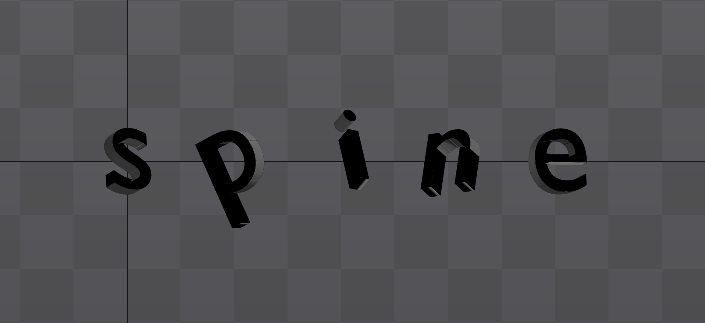
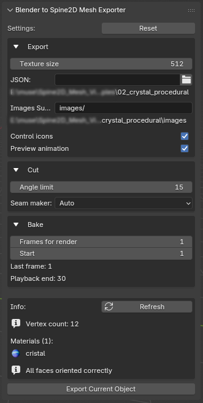

# Blender to Spine2D Mesh Exporter

<p align="center">
  
</p>

<p align="center">
  
  
  
  
  <a href="https://patreon.com/MaximSokolenko">
    
  </a>
</p>

<div align="center">
  <a href="https://www.youtube.com/watch?v=f_1Zc2qCz44">
    
  </a>
  <p><strong>Click to watch the video</strong></p>
</div>

Blender to Spine2D Mesh Exporter converts Blender mesh objects into Spine JSON, weighted mesh attachments, baked textures, generated rig data, and optional texture sequences. Version **0.80.1** uses a Blender 5.2-only Rewrite pipeline with deterministic geometry processing, explicit texture strategies, target-specific Spine codecs, source-data integrity checks, and atomic output commits.

## Requirements

- Blender 5.2 or newer.
- Spine 3.8.99, 4.0.64, 4.1.24, 4.2.43, or 4.3.23 for the matching selected JSON target.
- Windows is the currently tested desktop platform.
- The `.blend` file must be saved before export.
- Export destinations and source image dependencies must be readable and writable as required.

Blender 4.x and Blender 5.0/5.1 are not supported by the current extension package.

## Supported export scope

- Single-object and standalone multi-object export are supported for Spine 3.8 through Spine 4.3 according to the target/profile capability matrix.
- Spine 4.2 is the production target for connected and mixed composition.
- Spine 4.2 connected and mixed composition support both `3-Axis Rotation` and `2-Axis Rotation + Scale` profiles.
- Unsupported target, profile, and composition combinations fail before Blender geometry or bake work.
- Public selected-object export remains standalone-only. Connected and mixed services remain explicit development/API routes.

## Key features

- Deterministic automatic or custom-seam mesh segmentation.
- Source-loop UV lineage instead of coordinate-based nearest-point matching.
- Normal UV Segments export with one Spine mesh attachment per final region.
- Explicit Camera Projection export with render, crop, contour, and screen-space attachment generation.
- Cycles semantic object baking with Blender 5.2 state restoration.
- Animated material and object-transform sequence baking.
- Independent per-object texture timing in multi-object export: one object may use a sequence while sibling objects remain static.
- Texture Coordinate `Camera` and `Reflection` support in audited Normal UV object baking.
- Generated material fallback for missing or intentionally ignored source materials.
- Target-specific JSON serialization for Spine 3.8, 4.0, 4.1, 4.2, and 4.3.
- Legacy attachment-swap sequences for Spine 3.8 and 4.0.
- Native sequence metadata and timelines for Spine 4.1, 4.2, and 4.3.
- Connected and mixed Spine 4.2 composition with both supported rig profiles.
- Readiness analysis with structured blockers, warnings, and statistics.
- Atomic JSON and texture output with rollback and stale work-file recovery.
- Source mesh, UV layer, material graph, transform, Camera, and Blender-state integrity checks.

## Export modes

### Normal - UV Segments

This is the default mode. The exporter segments the source mesh, creates a generated bake UV layout, evaluates the source material graph on each sequence frame, bakes the appearance to texture files, and writes region-based Spine mesh attachments.

Animated location, rotation, and scale are synchronized to the temporary UV bake target for each frame. The local mesh topology and generated UV layout remain fixed.

### Camera Projection

This mode renders through the active Blender camera, derives alpha coverage, calculates one sequence-safe crop, builds a screen-space contour, and exports a projection attachment.

Camera Projection is selected explicitly. The exporter does not silently switch modes when a material uses camera-dependent inputs.

## Sequence support

A sequence can use the Scene frame rate or an explicit export frame rate. Every frame is staged and committed atomically with the final JSON.

For multi-object export, the Bake foldout stores `Frames` and `Start` separately for every selected Mesh:

```text
Frames = 0  → static texture evaluated at the current frame
Frames > 0  → Loop texture sequence only for that object
```

Objects with different timing settings may be exported together in one JSON and one atomic texture transaction. Static siblings do not receive sequence metadata or animation timelines.

The real Blender release gates cover:

- Spine 3.8, 4.0, 4.1, 4.2, and 4.3 standalone multi-object export;
- Normal - UV Segments and Camera Projection;
- all-sequence and mixed static/sequence object sets;
- connected and mixed Spine 4.2 export in both rig profiles and both texture modes;
- sequence ownership inside both connected and standalone mixed subgroups;
- animated object transforms and Camera/Reflection material inputs;
- PNG, attachment topology, sequence schema, composition hierarchy, and Blender-state restoration.

## Seam Maker defaults

`Seam Maker` defaults to **Auto**. Existing scenes created with earlier development builds are migrated once to the current settings schema. After migration, a deliberate user choice of **Custom** is preserved.

- **Auto** uses the configured angular segmentation policy.
- **Custom** uses user-marked seams and disables angular splitting controls.

## Quick start

1. Install `blender_to_spine2d_mesh_exporter-0.80.1.zip` through **Edit > Preferences > Extensions > Install from Disk**.
2. Save the `.blend` file.
3. Select one or more Mesh objects in Object Mode.
4. Open **3D View > Sidebar > Blender to Spine2D Mesh Exporter**.
5. Choose the exact Spine target, export mode, rig, generated-material, cut, and bake settings.
6. For selected-object export, set `Frames = 0` on static objects and a positive frame count only on objects that need a texture sequence.
7. Run **Analyze** and resolve every blocker.
8. Run **Export Current Object** or **Export Selected Objects**.
9. Import the generated JSON and textures into the exact Spine version selected during export.

See the [Usage Guide](docs/usage.md) and [Settings Reference](docs/settings-reference.md) for the complete workflow.

## Interface



The panel uses one consistent foldout sequence: Paths and Spine 2D version, Rig, Rewrite Generated Materials, Cut, Bake, and Analysis. Analysis is collapsed by default, runs only when Analyze is pressed, and never disables export.

## Output overview

A single-object export uses an object-derived stem:

```text
<ObjectName>_merged.json
images/<ObjectName>_Baked.png
```

A texture sequence uses zero-padded frame numbers:

```text
images/<ObjectName>_Baked_0000.png
images/<ObjectName>_Baked_0001.png
```

A multi-object export may contain both forms at once. Sequence objects use numbered files; static objects use one unnumbered baked texture. Multi-object output uses the first ordered object name plus the number of additional selected objects. File stems are sanitized for ordinary Windows file APIs.

See [Output Format](docs/output-format.md) for naming, attachment, sequence, and transaction details.

## Documentation

- [Documentation index](docs/README.md)
- [Installation](docs/installation.md)
- [Usage](docs/usage.md)
- [Settings reference](docs/settings-reference.md)
- [Architecture](docs/architecture.md)
- [Output format](docs/output-format.md)
- [Troubleshooting](docs/troubleshooting.md)
- [Testing and release validation](docs/testing.md)
- [Contributing](docs/CONTRIBUTING.md)
- [Changelog](docs/CHANGELOG.md)
- [Examples](examples/examples.md)

## Local build

Use Blender's official extension validator and builder through the repository wrapper:

```text
python tools/prepare_package.py --blender <path-to-Blender-5.2-executable>
```

The resulting ZIP is written to `dist` unless an explicit output path is supplied. Its root contains `blender_manifest.toml` and `__init__.py`.

See [Installation](docs/installation.md) and [Testing](docs/testing.md) for validation commands for version 0.80.1.

## Project structure

```text
Blender_to_Spine2D_Mesh_Exporter/
  application/        Export use-case orchestration and immutable request/result contracts
  blender_adapter/    Blender RNA, geometry, material, bake, camera, and UI boundaries
  domain/             Blender-independent geometry, UV, baking, and Spine models
  infrastructure/     Registration, diagnostics, locking, tracing, and atomic output
  blender_manifest.toml
  __init__.py

docs/                 Public user and developer documentation
examples/             Example Blender projects and example notes
tests/                Blender-independent test suite
tests_bpy/            Tests executed with a real bpy runtime
tools/                Packaging, comparison, audit, and validation tools
```

## Stability and support scope

The exporter rejects inputs when it cannot prove a safe geometry, UV, material, renderer, target-version, rig-profile, composition, or output contract. Complex non-manifold topology, missing required images, malformed UV layers, unsupported material graphs, invalid camera state, Edit Mode execution, or unsupported target/profile combinations can block export with structured diagnostics.

Keep backups of production scenes and validate generated assets in the selected Spine version before shipping.

## Contributing

Read [docs/CONTRIBUTING.md](docs/CONTRIBUTING.md) before changing production code or documentation. New behavior requires tests at the appropriate pure-Python, real-bpy, or Blender-headless boundary.

## License and credits

Copyright (c) 2025-2026 Maxim Sokolenko.

This project is licensed under GNU GPL v3.0 or later. Spine Editor and Spine runtimes remain subject to the applicable Esoteric Software licenses.
